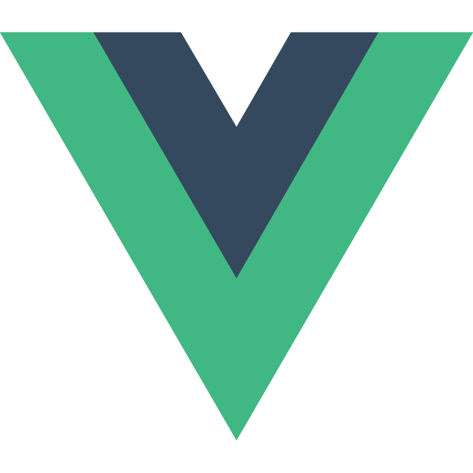

# Hi, I'm Hong Wei 👋

## About Me
I love turning ideas into applications that help others.

## Languages and Technologies

  
  &nbsp;
  
  &nbsp;
  
  &nbsp;
  
  &nbsp;
  
  &nbsp;
  
  &nbsp;
  
  &nbsp;
  
  &nbsp;
  
  &nbsp;
  
  &nbsp;
  
  &nbsp;
  
  &nbsp;
  
  &nbsp;
  
  &nbsp;
  
  &nbsp;
  
  &nbsp;
  

## Github Statistics

  

## Current Focus
- Fullstack Development
- AI/ML
- Web3
- Distributed Systems